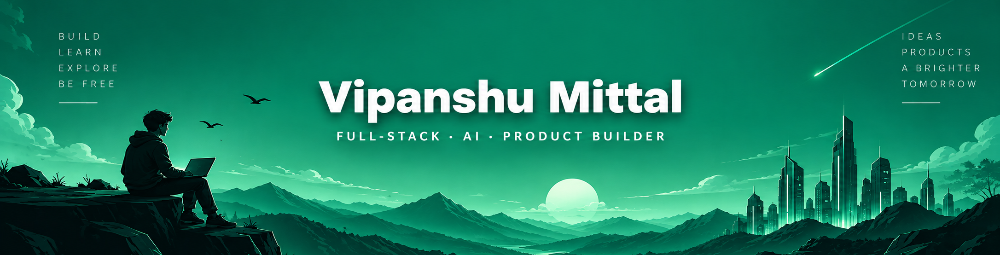
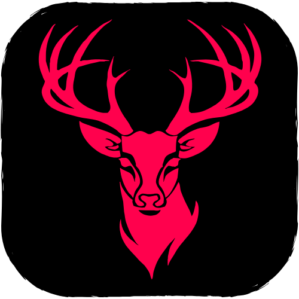
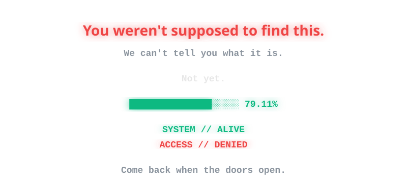
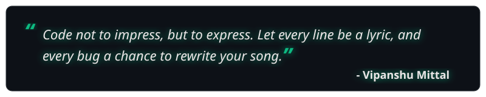
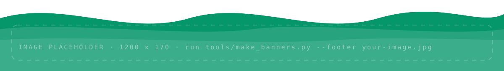

<!-- Profile README · VishuMittal004 · single accent: green (#10B981) on dark
     Artwork lives in /assets and is generated by tools/make_banners.py -->

 

&nbsp;&nbsp;
&nbsp;&nbsp;
&nbsp;&nbsp;
&nbsp;&nbsp;

 

I build full-stack products and AI agents, from voice assistants and computer-vision tools 
to real-time web apps, and I care as much about how a product feels as how it is built. 
Off the keyboard, I sing, edit reels and design in Figma.

<table align="center">
<tr>
<td align="center" width="260">
<b>EDUCATION</b>  
B.Tech, Computer Science &amp; Engineering 
Jaypee Institute of Information Technology, Noida 2023 &ndash; 2027
</td>
<td align="center" width="260">
<b>TRAINING</b>  
Trainee, Business Information Systems 
GAIL (India) Limited
</td>
<td align="center" width="260">
<b>FOCUS</b>  
AI agents, voice interfaces, computer vision, full-stack web 
Simplicity is my superpower
</td>
</tr>
</table>

 

  

 

 

<!-- 

  <h3>GAIL Canteen - Enterprise-Grade Full-Stack PWA</h3>
  

    <b>Smart dining for corporate efficiency.</b> 
    React + Vite, Supabase Realtime, Razorpay, and JWT Role-Based Security.
  

 -->

<!-- <table>
  <tr>
    <td width="33%" valign="top">
      <b>Real-time WebSockets</b> 
      Live order tracking and push (VAPID) notifications across the kitchen and customers.
    </td>
    <td width="33%" valign="top">
      <b>Serverless & Secure</b> 
      Vercel functions with per-role Row-Level Security on PostgreSQL tables.
    </td>
    <td width="33%" valign="top">
      <b>Analytics & Flow</b> 
      Admin analytics dashboard with revenue trends. Wireframed in Figma.
    </td>
  </tr>
</table> -->

<!--   -->

<table align="center">
<tr>
<td align="right" width="150"><b>FRONTEND</b></td>
<td>&nbsp;</td>
</tr>
<tr>
<td align="right"><b>BACKEND</b></td>
<td>&nbsp;&nbsp;&nbsp;</td>
</tr>
<tr>
<td align="right"><b>DATABASES</b></td>
<td></td>
</tr>
<tr>
<td align="right"><b>LANGUAGES</b></td>
<td>&nbsp;</td>
</tr>
<tr>
<td align="right"><b>TOOLS &amp; DEPLOY</b></td>
<td>&nbsp;&nbsp;&nbsp;&nbsp;</td>
</tr>
<tr>
<td align="right"><b>AI &amp; VISION</b></td>
<td></td>
</tr>
<tr>
<td align="right"><b>DESIGN &amp; MEDIA</b></td>
<td>&nbsp;</td>
</tr>
</table>

 

<table>
<tr>
<td width="50%" valign="top">

<h3><a href="https://github.com/VishuMittal004/AscendAI">AscendAI</a></h3>
<b>AI-powered goal architect</b>

Turns a long-term goal into a day-by-day learning roadmap. Add a new goal mid-plan and the AI merges it into the remaining schedule. Live streaks and progress stats, JWT auth, OpenRouter LLM, Framer Motion throughout.

<a href="https://ascend-ai-jiit.vercel.app/"><b>Live demo</b></a> &nbsp;&middot;&nbsp; <a href="https://github.com/VishuMittal004/AscendAI"><b>Source</b></a>

</td>
<td width="50%" valign="top">

<h3><a href="https://github.com/VishuMittal004/Nuclear-Reactor-Simulator">Nuclear Reactor Simulator</a></h3>
<b>Interactive physics dashboard</b>

A real-time neutron chain-reaction simulator on a custom point-kinetics engine. Move control rods, inject neutrons, change fuel efficiency, and watch keff, thermal power and doubling time respond live.

<a href="https://nuclear-reactor-simulator-six.vercel.app"><b>Live demo</b></a> &nbsp;&middot;&nbsp; <a href="https://github.com/VishuMittal004/Nuclear-Reactor-Simulator"><b>Source</b></a>

</td>
</tr>

<tr>
<td width="50%" valign="top">

<h3><a href="https://github.com/VishuMittal004/SnapSensei">SnapSensei</a></h3>
<b>Real-time AI vision assistant</b>

YOLOv8 detects objects through your webcam. Lock onto a target, get an AI-written description, hear it read aloud, or press <code>M</code> and ask about it by voice.

<a href="https://github.com/VishuMittal004/SnapSensei"><b>Source</b></a>

</td>
<td width="50%" valign="top">

<h3><a href="https://github.com/VishuMittal004/BARTR--Swap-Your-Skills">BARTR</a></h3>
<b>Swap skills, not just cash</b>

A skill-exchange platform with complementary-skill matching, in-app chat, barter requests, course recommendations, rupee transfers, and report and block safety tools. Ships with an Android APK.

<a href="https://bartr1.vercel.app/"><b>Live demo</b></a> &nbsp;&middot;&nbsp; <a href="https://github.com/VishuMittal004/BARTR--Swap-Your-Skills"><b>Source</b></a>

</td>
</tr>

<tr>
<td width="50%" valign="top">

<h3><a href="https://github.com/VishuMittal004/Aero-Route">Aero-Route</a></h3>
<b>Flight booking and flight-path simulator</b>

A terminal booking system with five-day dynamic pricing that hands off to an SFML simulator: animated aircraft on a map, with weather conditions that trigger rerouting.

<a href="https://github.com/VishuMittal004/Aero-Route"><b>Source</b></a>

</td>
<td width="50%" valign="top">

<h3><a href="https://github.com/VishuMittal004/GamingArcade">GamingArcade</a></h3>
<b>Six classic games in one C++ program</b>

Battleship, Connect Four, Minesweeper, Tic Tac Toe, Sudoku and Numpuzz: grids, turn systems and game logic in standard C++.

<a href="https://github.com/VishuMittal004/GamingArcade"><b>Source</b></a>

</td>
</tr>
</table>

 

  

  

  

<!-- Snake: generated by .github/workflows/snake.yml and pushed to the `output` branch. Until the action runs, this might show as a broken image. -->
<picture>
  <source media="(prefers-color-scheme: dark)" srcset="https://raw.githubusercontent.com/VishuMittal004/VishuMittal004/output/github-snake-dark.svg?v=1"/>
  <source media="(prefers-color-scheme: light)" srcset="https://raw.githubusercontent.com/VishuMittal004/VishuMittal004/output/github-snake.svg?v=1"/>
  
</picture>

 

 

<!--  -->

